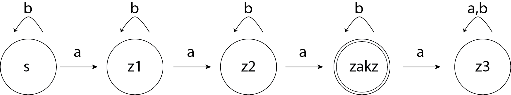

# Chess Pet Project
by Daniel Kurta

This project implements a simple chessbot based on
the negamax-algorithm. It uses [the python-chess library](https://python-chess.readthedocs.io/en/latest/index.html).

## UML

## Metrics
For generating metrics for the Chess Pet Project, i used [sonarcloud.io](sonarcloud.io)
 sonarcloud is easy to use in that way. You can simply subscribe with your
 github-account and import the project you want to investigate. Than you only have to
 to add the sonar-scanner to the local %PATH% and run it in the local
 directory. After these steps, you can see the metrics on the sonarcloud.io page.

## Clean Code Development
#### 1. Avoid magic numbers
There are fixed values for ratings for won or drawn games declared at the
beginning of the evaluation function in Evaluation.py. That is better than
hard-coding them as magic numbers at the place where they are needed.
#### 2. Explanatory Variables
#### 3. Source Code Conventions
The code style has been checked for the PEP 8 -- Style Guide for Python
 Code while programming. It covers e.g. naming and layout conventions.

## Build Management
This project gets builded with Ant via the `build.xml` file in the `.`
directory of the project.

`build.xml` defines the process of deployment of the files in the project's
folder and how they get copied into an other directory. The steps in this process
 (called "targets") have dependencies to other targets. That is the way to keep
  a structure in the buildprocess and calling them one after an other. Values and
  paths that are used in the buildfile are declared as values and locations with a
  property tag.

## Continous Delivery

## DSL

## Functional Programming

## Logical Programming
(./logical_programming/graph_search.pl)

For a little project in logical programming in Prolog, i adressed
the problem of the membership of a word to a language given by a
[deterministic finite automaton (DFA)](https://en.wikipedia.org/wiki/Deterministic_finite_automaton)
shown in the picture. It represents the language over the alphabet {a, b}
 containing words, that have exactly 3 a's. The transition function of the
DFA is represented in the knowledge base by the fact edge/3 where the
first argument is the initial state, the second is the next state and the
third is the symbol.
The rule isElementOfL/1 takes a word as input parameter and decides
 if a word (represented as a list) is part of the language represented
 by the DFA with the help of the rule stateChange/3, which calls
 itself in a recursive way for wordes with a length > 2.

 Example Queries are:
* isElementOfL([a, b, a, b, a]). which returns "True."
* isElementOfL([a, b, b, a, b]). which returns "False." because it
only has 2 a's