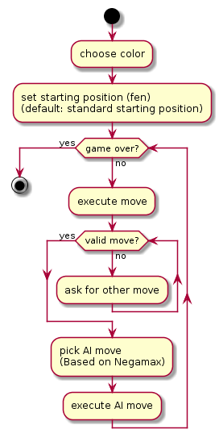

# Chess Pet Project
by Daniel Kurta

This project implements a simple chessbot based on
the Negamax-algorithm. It uses [the python-chess library](https://python-chess.readthedocs.io/en/latest/index.html).

## UML
All UML diagrams are created with PlantUML. The source code for them can
be found [in the uml directory.](./doc_ressources/uml)
#### Activity Diagram

#### Use Case Diagram

#### Component Diagram

#### Class Diagram

## Metrics
For generating metrics for the Chess Pet Project, i used [sonarcloud.io](sonarcloud.io)
 sonarcloud is easy to use in that way. You can simply subscribe with your
 github-account and import the project you want to investigate. Than you only have to
 to add the sonar-scanner to the local %PATH% and run it in the local
 directory. After these steps, you can see the metrics on the sonarcloud.io page.
 The code analysis with sonarqube is also part of the Jenkins Pipeline.

## Clean Code Development
#### 1. Avoid magic numbers
There are fixed values for ratings for won or drawn games declared at the
beginning of the evaluation function in Evaluation.py. That is better than
hard-coding them as magic numbers at the place where they are needed.
#### 2. Explanatory Variables
The naming of the variables is as simple and understandable as possible.
Examples are:
* TRANSLATION_PIECES for a dict that maps german names of pieces to san notations.
* RATING_FOR_GAME_WON_BY_WHITE for a constand value for a game won by white. The name is long,
but it contains everything a reader needs to know!
* PIECE_VALUES is a dict that maps numeric values to names of pieces
* 'depth' for the searching depth of the Negamax algorithm
#### 3. Source Code Conventions
The code style has been checked for the PEP 8 -- Style Guide for Python
 Code while programming. It covers e.g. naming and layout conventions.
#### 4. Static Code Analysis
Used sonarqube for SCA. See **Metrics**
#### 5. You ain't gonna need it (YAGNI)
Every function that is implemented in the project is used.
#### 6. Use a Build Tool
See **Build Management**
#### 7. DRY (Don't repeat Yourself)
It is better to write code just once in a project. See *Duplicates* **Metrics**
#### 8. Usage of comments
Comments are used through the whole project. They explain non-trivial statements or
are used as docstrings, for example on top of the MoveDSL.py file and in every
method.

## Build Management

This project is builded with Ant via the `build.xml` file in the `.`
directory of the project.

`build.xml` defines the process of deployment of the files in the project's
folder and how they get copied into an other directory. The steps in this process
 (called "targets") have dependencies to other targets. That is the way to keep
  a structure in the buildprocess and calling them one after an other. Values and
  paths that are used in the buildfile are declared as values and locations with a
  property tag.

## Continuous Delivery

The pipeline for continuous delivery of the Chess Pet Project was build with
 Jenkins and can be seen in the `./Jenkinsfile`. The process contains 4 stages:

 * Greet: calls a simple .bat-File with a greeting message
 * Build Metrics: calls a .bat-Script that runs the sonar-scanner
 * Deploy: runs the build.xml-File via the ant command
 * Say Good Bye: calls a simple .bat-File that echos "Goodbye!"

Before Jenkins starts the first stage, it pulls the repository from github.
This process was configured in the Jenkins browser frontend while setting up
the Pipeline.

## DSL
In the Chess Pet Project, two Domain Specific Languages are used. The
first one is the [Standart Chess Notation (san)](https://en.wikipedia.org/wiki/Algebraic_notation_(chess)) for chess moves which is
used to enter the moves the player wants to execute.

As an extension of san, i invented the German Chess Domain Specific Language
that describes moves in a high level way. It is inspired by the german language and can
be used instead of san for communicating moves. The GcDSL's implementation
is located in `./chess_src/MoveDSL.py`.

Its Syntax is pretty easy:

`"{figureType (required)} {action (required)} {file or rank (not required)} \
    {field (required)} {figureTypeConversion (note required)} {Schach/Schachmatt (not required)}"`

or

`"{kurze Rochade | lange Rochade (required)} {Schach/Schachmatt (not required)}"`

Examples for the German Chess DSL:

* "Bauer nach d6" -> "d6"
* "Bauer c schlägt d6" -> "cxd6"
* "Turm f nach e1" -> "Rfe1"
* "Springer schlägt f3 Schach" -> "Nxf3+"
* "kurze Rochade" -> "0-0"
* "Bauer b schläg a8 Dame" -> "bxa8=Q"
* "Läufer schlägt e5 Schachmatt" -> "Bxe5++"

## Functional Programming

The implementation of the parser for the German Chess DSL is programmed
 in a functional way. I've tried to cover several functional definitions in
 `chess_src/MoveDSL.py` like:

#### Only final data structures

Every data structure that is used doesn't get changed after
 declaration (line 23-37). That makes the code stateless.

#### Side effect free functions

The functions are only used to compute a result from an input. They don't change
any variables from outer scope and have no side effects.

#### Higher order functions and functions as parameters

In line 48, the higher order function map is used in combination with a
lambda expression as parameter to generate a list containing identifiers for the
ranks of a chess board. The usage may seem arbitrary, but it's implemented
as a prove of concept.
An other example for the usage of a map function with lambda can be found in
`./chess_src/Util.py`.

#### Usage of a closure

In line 94, there is a definition of a closure for a counter. The variable
for the counter can only be addressed by calling the function, because it only
exists in its scope. That makes sure that the counter can not be manipulated
by other functions.

## Logical Programming
The logical programming part is located in
`./logical_programming/graph_search.pl)`.

For a little project in logical programming in Prolog, i adressed
the problem of the membership of a word to a language given by a
[deterministic finite automaton (DFA)](https://en.wikipedia.org/wiki/Deterministic_finite_automaton)
shown in the picture. It represents the language over the alphabet {a, b}
 containing words, that have exactly 3 a's:

  `L = {w | w contains exactly 3 a's}`

  **A similar DFA or a NFA (Nondeterministic Finite Automaton) could be used to
  check the affiliation of an input to the set that describes the German Chess DSL.**

  The transition function of the
DFA is represented in the knowledge base by the fact edge/3 where the
first argument is the initial state, the second is the next state and the
third is the symbol that invokes a transfer of from the first to the
second state.
The rule isElementOfL/1 takes a word as input parameter and decides
 if a word (represented as a list) is part of the language represented
 by the DFA with the help of the rule stateChange/3, which calls
 itself in a recursive way for words with a length > 2.

 Example Queries are:
* isElementOfL([a, b, a, b, a]). which returns "True."
* isElementOfL([a, b, b, a, b]). which returns "False." because it
only has 2 a's