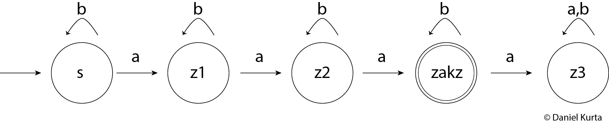

# Logical Programming

For a little project in logical programming in Prolog, i adressed
the problem of the membership of a word to a language given by a
[deterministic finite automaton (DFA)](https://en.wikipedia.org/wiki/Deterministic_finite_automaton)
shown in the picture. It represents the language over the alphabet {a, b}
 containing words, that have exactly 3 a's:

  `L = {w | w contains exactly 3 a's}`

  The transition function of the
DFA is represented in the knowledge base by the fact edge/3 where the
first argument is the initial state, the second is the next state and the
third is the symbol that invokes a transfer of from the first to the
second state.
The rule isElementOfL/1 takes a word as input parameter and decides
 if a word (represented as a list) is part of the language represented
 by the DFA with the help of the rule stateChange/3, which calls
 itself in a recursive way for wordes with a length > 2.

 Example Queries are:
* isElementOfL([a, b, a, b, a]). which returns "True."
* isElementOfL([a, b, b, a, b]). which returns "False." because it
only has 2 a's